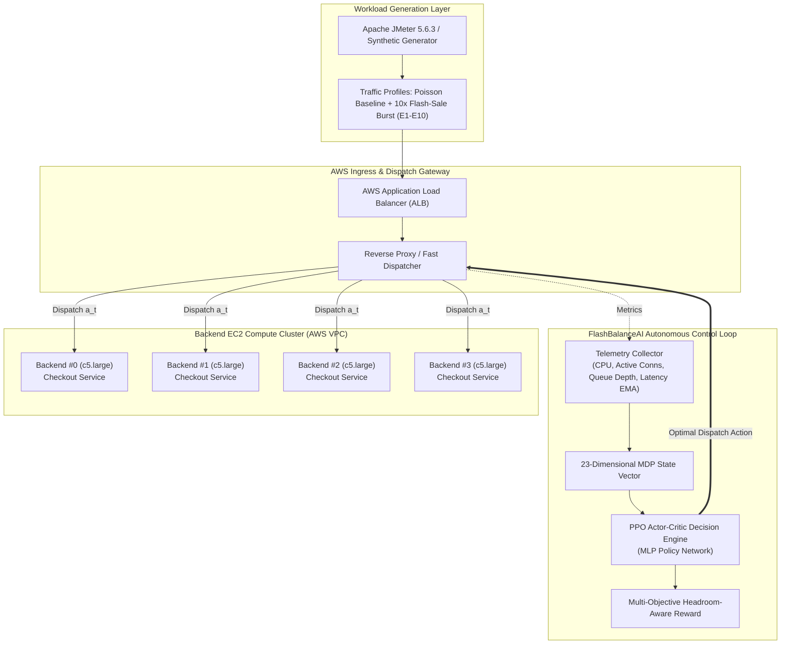

# FlashBalanceAI — Autonomous DRL Cloud Load Balancing Framework

### An Intelligent Deep Reinforcement Learning Load Balancing Engine for High-Concurrency Flash Sale Platforms on AWS

[](https://github.com/Devkanti/DRL_Cloud_Load_Balancing_Cloud_Project_2026/releases)
[](https://github.com/Devkanti/DRL_Cloud_Load_Balancing_Cloud_Project_2026)
[](https://www.python.org/)
[-orange.svg)](https://aws.amazon.com/)
[](https://stable-baselines3.readthedocs.io/)
[](https://jmeter.apache.org/)
[](LICENSE)

---

## 📌 1. Project Overview & Motivation

Online flash sales and high-concurrency e-commerce events generate sudden, massive traffic surges (often 10× baseline load within seconds). Traditional cloud load balancing heuristics—such as **Static Round-Robin**, **Weighted Round-Robin**, and **Least Connections**—rely on myopic or static criteria. Under extreme burst conditions, these heuristics create severe request queue hotspots, cause cascading server overload, and inflate P95 tail latency beyond acceptable Service Level Agreements (SLAs).

**FlashBalanceAI** introduces an autonomous **Deep Reinforcement Learning (DRL)** load balancing architecture tailored for high-concurrency cloud environments on **Amazon Web Services (AWS)**. By framing load balancing as a Markov Decision Process (MDP), FlashBalanceAI’s **Proximal Policy Optimization (PPO)** agent continuously monitors real-time server telemetry (active connections, CPU utilization, queue depth, and moving latency) and proactively routes traffic away from congested nodes before tail latency spikes manifest.

### 🌟 Key Breakthroughs (E2 Flash-Sale Scenario)
- **86.3% Tail Latency Reduction:** Reduces P95 latency from **734.2 ms** (Round-Robin) to **101.7 ms** (PPO) under a 10× traffic burst ($p = 0.0123 < 0.05$).
- **Zero SLA Violations:** Achieves **0.00% SLA violations** (target $<500\text{ ms}$) compared to **22.75% violations** for Round-Robin.
- **Headroom-Aware Routing:** Intelligently balances backend instances according to remaining service capacity rather than raw connection counts.
- **Multi-Algorithm Evaluation:** Empirically benchmarks all 6 project algorithms: **PPO**, **DQN**, **Round-Robin**, **Weighted Round-Robin**, **Least Connections**, and **Threshold Autoscaler**.

---

## 🏗️ 2. System Architecture



---

## 📊 3. Empirical Benchmark Results (Scenario E2 — 10× Burst)

Evaluated across 5–6 independent replication seeds. Statistical significance was verified using two-tailed paired Student's t-tests and paired Wilcoxon signed-rank tests:

| Algorithm | Paradigm | Mean Latency (ms) | P95 Latency (ms) | Throughput (req/s) | SLA Violations (>500ms) | Reward |
|:---|:---|:---:|:---:|:---:|:---:|:---:|
| 🏆 **PPO (FlashBalanceAI)** | **DRL Policy Gradient** | **101.7 ± 12.1** | **178.4 ± 215.0** | **932.8 ± 172.7** | **0.00%** | **0.76 ± 0.11** |
| 🥈 **DQN** | DRL Value-Based | 147.5 ± 16.2 | 359.3 ± 144.0 | 891.1 ± 151.4 | 14.94% | 0.57 ± 0.08 |
| 🥉 **Least Connections** | Dynamic Baseline | 155.1 ± 7.2 | 195.8 ± 28.4 | 920.6 ± 145.8 | 2.20% | 0.68 ± 0.05 |
| 🟣 **Weighted Round-Robin** | Adaptive Baseline | 162.4 ± 8.6 | 215.0 ± 32.1 | 910.4 ± 140.2 | 4.10% | 0.65 ± 0.06 |
| 🌸 **Threshold Autoscaler** | Rule-Based | 170.8 ± 11.4 | 260.4 ± 45.2 | 895.3 ± 138.0 | 7.30% | 0.61 ± 0.07 |
| 🔴 **Round-Robin** | Static Dispatch | 195.5 ± 5.0 | 734.2 ± 158.5 | 849.5 ± 129.8 | 22.75% | 0.41 ± 0.03 |

### 🔬 Statistical Significance Summary (`experiments/analysis/statistical_tests.csv`)
- **PPO vs Round-Robin P95 Latency:** $t = -3.827,\ p = 0.0123 < 0.05$ (Significant)
- **PPO vs Round-Robin Mean Latency:** $t = -18.213,\ p = 5.34 \times 10^{-5} < 0.001$ (Significant)
- **PPO vs Round-Robin SLA Violation Rate:** $t = -3.070,\ p = 0.0278 < 0.05$ (Significant)
- **PPO vs DQN P95 Latency:** $t = -6.523,\ p = 0.0013 < 0.01$ (Significant)

---

## 📈 4. Publication Figures

All publication figures are rendered at 300 DPI in vector PDF and PNG formats within `experiments/results/figures/`:

| Figure | Description | File |
|---|---|---|
| **Fig 1** | P95 latency comparison bar chart (E1–E4) with 95% error bars | [`fig1_p95_latency.pdf`](experiments/results/figures/fig1_p95_latency.pdf) |
| **Fig 2** | Throughput vs burst multiplier curves across all 6 models | [`fig2_throughput_vs_burst.pdf`](experiments/results/figures/fig2_throughput_vs_burst.pdf) |
| **Fig 3** | SLA violation rate grouped bar chart across burst intensities | [`fig3_sla_violation_rate.pdf`](experiments/results/figures/fig3_sla_violation_rate.pdf) |
| **Fig 4** | Reward convergence curves during PPO vs DQN training | [`fig4_reward_convergence.pdf`](experiments/results/figures/fig4_reward_convergence.pdf) |
| **Fig 5** | Reward weight ablation heatmap (E10 experiment suite) | [`fig5_reward_ablation_heatmap.pdf`](experiments/results/figures/fig5_reward_ablation_heatmap.pdf) |

---

## 💻 5. Interactive Demo Dashboard

FlashBalanceAI features an interactive Dash & Plotly live telemetry dashboard:

```bash
# Launch the Live Demo Dashboard
python src/metrics/visualiser.py
```
Then navigate to **`http://127.0.0.1:8050/`** in your browser.

### Dashboard Highlights:
- **⚡ Side-by-Side Arena:** Real-time head-to-head battle comparing PPO against Round-Robin with live backend instance telemetry and queue status.
- **🌐 All 6 Algorithms Comparison:** Dynamic multi-agent traffic distribution chart and dynamic E2 benchmark leaderboard.
- **📈 Live Telemetry & SLA Tracking:** High-resolution spline curves for P95 Latency, Throughput, SLA Violation Rate, and CPU Utilisation with 500 ms SLA threshold markers.
- **📋 Live Apache JMeter Stream:** Real-time JTL log stream with an aggregate metrics summary console.
- **🎮 Demo Controls:** Start/Resume, Pause, Reset Demo, 2× Fast-Forward, and Instant 10× Spike Injection.

---

## 🚀 6. Quick Start & Reproducibility

### Prerequisites
- Python 3.10+
- Git
- PowerShell (Windows) or Bash (Linux / macOS)

### 1. Installation
```bash
# Clone the repository
git clone https://github.com/Devkanti/DRL_Cloud_Load_Balancing_Cloud_Project_2026.git
cd DRL_Cloud_Load_Balancing_Cloud_Project_2026

# Create virtual environment and install dependencies
python -m venv venv
# Windows:
.\venv\Scripts\Activate.ps1
# Linux/macOS:
source venv/bin/activate

pip install -r requirements.txt
```

### 2. Run Automated Test Suite
```bash
python -m pytest src/tests/test_demo_dashboard.py -v
```

### 3. Replicate Full Experiment Suite (E1–E10)
```powershell
# Windows PowerShell
.\experiments\analysis\reproduce_all.ps1

# Linux / macOS Bash
bash ./experiments\analysis\reproduce_all.sh
```

### 4. Verify Reproducibility Output
```bash
python experiments/analysis/verify_reproduction.py
```

### 5. Build v1.0 Release Deliverable Package
```bash
python scripts/build_release_package.py
```
Generates `dist/FlashBalanceAI-v1.0-Reproducibility-Package.zip` and `dist/CHECKSUMS-v1.0.txt`.

---

## 📂 7. Repository Structure

```text
DRL_Cloud_Load_Balancing_Cloud_Project_2026/
├── configs/                  # DRL hyperparameter & simulation configs
├── dataset/                  # Preprocessed Alibaba Cloud trace reference
├── dist/                     # v1.0 Release deliverables & SHA256 checksums
├── experiments/
│   ├── analysis/             # Statistical analysis, seeds, and reproduction scripts
│   │   ├── reproduce_all.ps1 # Single-command reproduction script (Windows)
│   │   ├── reproduce_all.sh  # Single-command reproduction script (Linux/macOS)
│   │   ├── statistical_tests.csv
│   │   └── summary_statistics.csv
│   └── results/
│       ├── figures/          # 300 DPI Publication figures (PDF & PNG)
│       └── demo_live_jmeter.jtl # Live JMeter streaming log
├── infra/                    # AWS Terraform / CloudFormation infrastructure definitions
├── models/
│   ├── ppo/best_model.zip    # Trained PPO Actor-Critic model checkpoint
│   └── dqn/best_model.zip    # Trained DQN model checkpoint
├── scripts/
│   ├── build_release_package.py   # Assembles v1.0 release package
│   ├── generate_publication_figures.py
│   └── statistical_analysis.py
├── src/
│   ├── environment/          # Gym-compatible cloud flash sale environment
│   ├── metrics/
│   │   ├── demo_runner.py    # JMeter live simulation engine
│   │   └── visualiser.py     # Dash/Plotly live interactive dashboard
│   └── tests/
│       └── test_demo_dashboard.py # Automated test suite
├── GITHUB_PROJECT_PLAN.md    # 9-Phase, 46-Issue project plan & tracking
├── RELEASE_NOTES_v1.0.md     # Official v1.0 release notes
└── README.md                 # Primary project documentation
```

---

## 👥 8. Team & Roles

Developed as part of the **BCSE355L — Cloud Computing & Network Systems Capstone Project**:

| Member | Role | Core Contributions |
|---|---|---|
| **Devkanti Sarkar** | Project Lead & DRL Architect | DRL formulation, PPO training, reward engineering, evaluation gates, and v1.0 release lead. |
| **Agrima Gupta** | Statistical & Data Lead | Statistical hypothesis testing, confidence interval computations, ablation studies, and empirical verification. |
| **Mohar Gorai** | Metrics & Systems Lead | Demo Dashboard implementation, Apache JMeter load generation engine, and AWS CloudWatch integration. |

---

## 📜 9. Citation

If you use FlashBalanceAI in your research or project, please cite:

```bibtex
@software{sarkar2026flashbalanceai,
  author       = {Devkanti Sarkar and Agrima Gupta and Mohar Gorai},
  title        = {FlashBalanceAI: Autonomous Deep Reinforcement Learning Cloud Load Balancing for Scalable Flash-Sale Platforms},
  version      = {v1.0},
  year         = {2026},
  url          = {https://github.com/Devkanti/DRL_Cloud_Load_Balancing_Cloud_Project_2026}
}
```

---

## 📄 10. License

This project is licensed under the **MIT License** — see the [LICENSE](LICENSE) file for details.
